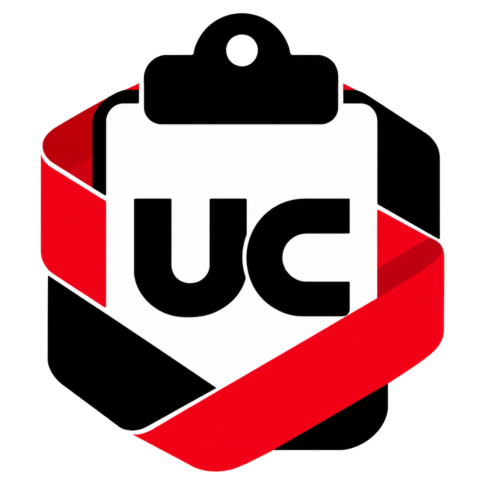

<div align="center">
  

  # Ultra Clipboard

  **适用于 macOS 与 Windows 的本地优先剪贴板管理器。**

  [한국어](./README.md) | [English](./README.en.md) | 简体中文

  <br />

  
  
  
  
  
</div>

## 关于

Ultra Clipboard 是一个开源桌面剪贴板管理器，将复制的内容保存在本机，方便快速查找和再次使用。项目采用 Rust-First 的 Tauri 架构，并使用 React 构建界面，默认 UI 语言为韩语。

本项目是基于 [EcoPasteHub 的 EcoPaste](https://github.com/EcoPasteHub/EcoPaste) 的独立维护 fork，与 EcoPasteHub 没有隶属或官方合作关系，由 `toughCSB` 独立维护和发布。

## 功能

- 采集纯文本、HTML、RTF、图片、文件和文件夹等剪贴板内容。
- 使用 SQLite FTS5 搜索剪贴板正文与备注。
- 按来源应用和内容类型过滤历史记录。
- 显示文件的完整路径，并可定位记录的文件。
- 识别并保护高置信敏感内容，例如私钥、服务 Token、AWS Key 和 JWT。
- 在独立预览窗口中查看文本、图片和文件记录。
- 支持粘贴、复制、复制为纯文本、定位文件、打开链接、添加备注、置顶、收藏、删除，以及将记录拖出到其它应用。
- 通过收藏、置顶、备注、自定义分组和可配置快捷动作组织历史记录。
- 可调整采集顺序、大小限制、保留策略、展示密度、列表排序和窗口行为，并可开启复制声音反馈。
- 默认保留一个月，约 30 天。保留周期可在设置中修改，收藏和置顶项目不参与自动清理。
- 支持导出和导入 `.ecopastebak` 备份，包括加密备份包。
- 剪贴板数据、资源缓存和设置均保存在本机。

## 备份与数据兼容性

WebDAV 备份和恢复需要在设置中手动执行，不是实时同步。Ultra Clipboard 不提供通过 Tailscale 的实时同步。出于安全考虑，仅支持 HTTPS WebDAV 地址，且备份文件不会包含 WebDAV 密码。

Ultra Clipboard 使用独立于 EcoPaste 的数据 namespace。要导入官方 EcoPaste 数据，请先在 EcoPaste 中创建 `.ecopastebak` 备份，再通过 Ultra Clipboard 的备份导入功能导入。不会自动迁移现有数据。

## 支持的平台

- Windows
- macOS

不支持 Linux。`v1.1.1-rc.1` 是预发布版本，macOS runtime QA 尚未完成。

## 下载与安装

请从 [Releases](https://github.com/toughCSB/Ultra-Clipboard/releases) 下载构建版本。

当前 `v1.1.1-rc.1` 未签名，Windows SmartScreen 或 macOS Gatekeeper 可能显示警告。使用前请核对来源和文件。本版本不声称已完成代码签名或 notarization。

## 开发

需要 macOS 或 Windows、Node.js 20 及以上、pnpm 10 及以上，以及 Rust toolchain。

```bash
pnpm install
pnpm tauri dev
pnpm tauri build
```

检查前端和 Rust 代码：

```bash
pnpm lint
pnpm tsc
cd src-tauri
cargo fmt --check
cargo clippy -- -D warnings
cargo test
```

## 参与贡献

开发环境、架构说明、质量检查和贡献要求请阅读[贡献指南](./CONTRIBUTING.zh-CN.md)。

## 开源协议

Ultra Clipboard 基于 [Apache License 2.0](./LICENSE) 开源。原项目的版权声明继续保留，fork 的修改内容另见 [NOTICE](./NOTICE)。
